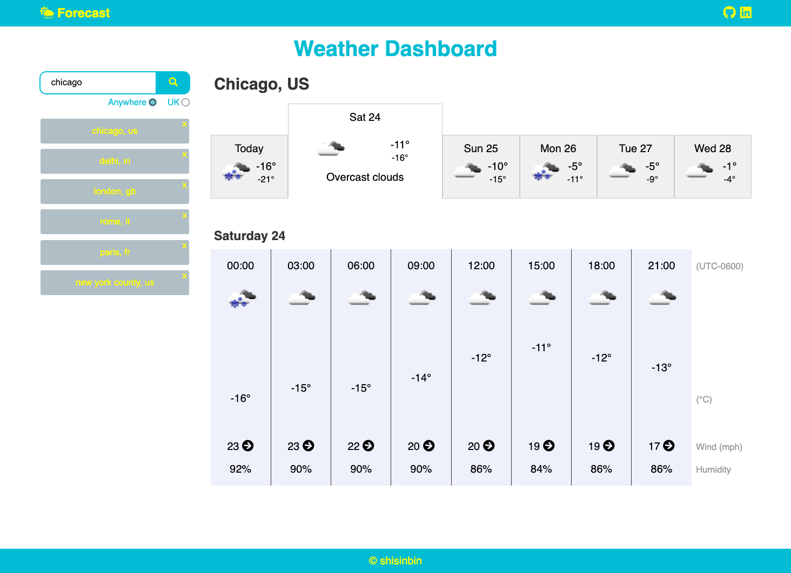
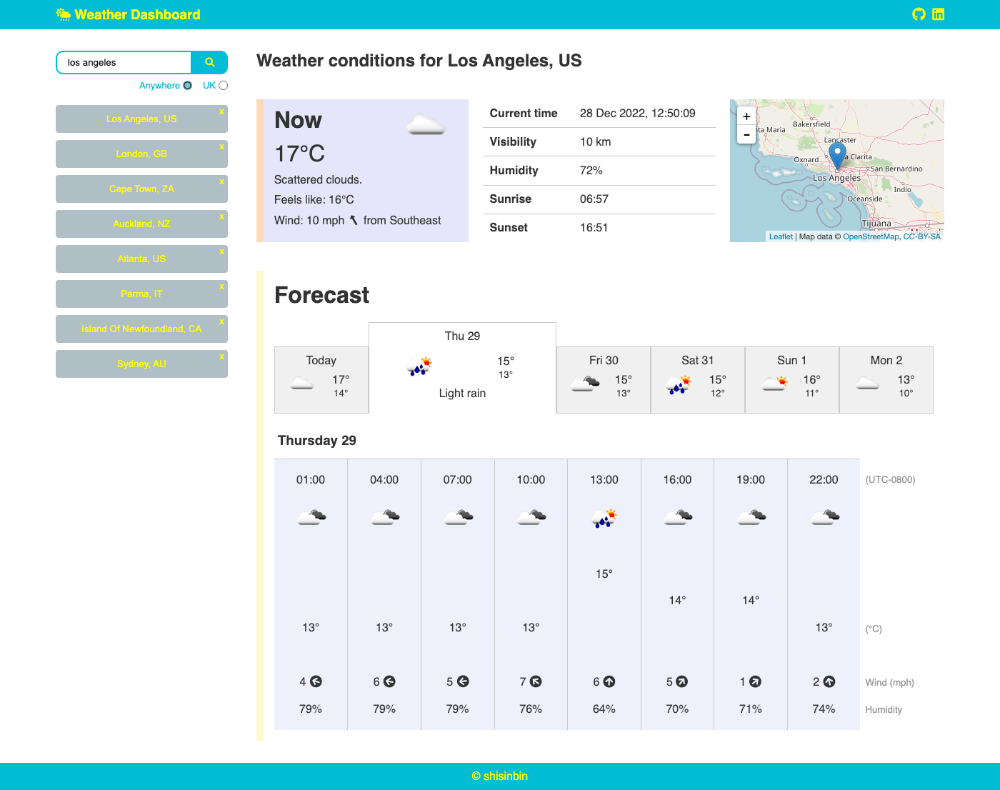

<a name="top"></a>

# Development

## Description

So I want to document my thoughts and experiences when working on this app in a cohesive way so that I can come back to this app and understand how I did a lot of the stuff in it. I think some kind of blog post would be suitable. Or maybe just a separate md file, which I've now created.

## Table of contents

- [New Year's Eve 2022](#new-years-eve-2022)
- [Jan 3 2023](#jan-3-2023)
- [Nov 30 2023](#30-nov-2023)

## New Year's Eve 2022

Some screenshots at different points of development




28 Dec 2022:



Jan 4 - Nov 30


### Summary of things learnt

I've spent a ton of work on this to be honest but I've learnt a lot. It's really important that I document how I did several things, if only so that I can look back and understand things myself. Off the top of my head, the things that stand out are:

- `position: absolute`, `position: relative`, for taking elements out of the flow of the page but bounded by its parent. Really useful for positioning items (e.g., the 'x' close button for recent searches, the larger icon in the 'Now' panel, the temperatures in the hourly breakdown)
- A lot of stuff to do with Moment.js, particularly understanding UTC time, UTC offsets, yada yada
- Using global CSS rules, e.g. a `wrapper` class for wrapping elements to a certain width or with common padding and margin
- using `.map()` and `.filter()` to cherry-pick data, e.g. getting all the days of the month from a single property in an array of objects, or filtering an array of forecasts based on a condition.
- a bit of stuff on regex or character mapping (`.match()`) which was useful for ensuring the -ve sign was considered when converting a string to a number
- integrating maps, so both Leaflet and OpenStreetMap
- stopping event propagation, which was important when the 'x' was clicked in a parent element that also had an event listener

On top of that

- more practice with translating logic or pseudocode into actual code
- dealing with error debugging (a lot of console.log()ing)
- spending a bunch of time trying to get things to look a certain way, or position themselves how I want them to
- spending an even greater amount of time on colour schemes and layout (struggled big time here tbh)
- more practice with jQuery and taking advantage of how it makes some things easier, particularly traversal, looping and fetching API data

## Jan 3 2023

Things I learnt while working on this app...

### Taking elements out of the flow of the page

By setting an element to `position: absolute` and setting a parent element (not necessarily direct) to `position: relative` you can take that child element out of the flow of the page and position it exactly relative to the parent. So, for example, to position two child elements to be exactly in the centre of the parent element, the following CSS might look like:

<code>
.parent {
  height:40px;
  position: relative;
}

.child1 p {
position: absolute;
left: 50%;
top: 50%;
transform: translate(-50%,-50%);
z-index: 2;
}

.child2 img {
position: absolute
left: 50%;
top:50%;
z-index: 1;
}
</code>

Notice the `z-index` property too. This is used to indicate which element should have priority. So here the p element has a higher z-index over the img element and should be seen over the image.

Taking elements out of the flow of the page was particularly useful for:

- adding a small 'x' in the corner of recent search buttons
- positioning the weather icon in the top right corner of the 'Now' panel
- adding wind direction images and overlaying it with the wind speed
- positioning tooltips to appear directly below an image when the mouse hovers over it
- positioning the temperature element to be at a certain height relative to the max and min temp that day

### Understanding how to use Moment.js for being timezone-aware

The weather data included unix-based timestamps in UTC time, and timezone 'shifts' representing the number of seconds to shift the timestamp in order to get the local time.

To show the local time for each location and to indicate how many hours it was different from UTC time, I had to make use of the Moment.js library.

To work out the local 'moment' of aForecast:

- `localMoment = moment.unix(aForecast.dt).utcOffset(aForecast.timezone / 60)`

Then you could chain on a `.format('yada yada')` to it. The way it works is that `utcOffset()` receives either a positive or negative offset in terms of _minutes_ to adjust the time, hence why the timezone shift is divided by 60 to get it into minutes.

To do a local clock or timer, I had to do a few things:

- work out the timezone offset in minutes: `timezoneOffset = localMoment.utcOffset()` gives the number of minutes a moment is offset from UTC time by.
- use this offset on the user's local time `currentTime = moment().utcOffset(timezoneOffset)`

It works correctly based on my time, but my local time is UTC+0000, so not sure if it would work the same if a user from a different timezone were to use it. Maybe I should look into that...

### Global CSS rules

Hmm, what did I want to mention about Global CSS rules I wonder?

## 30 Nov 2023

Revisiting this app to try and gain some practise with JS and CSS. The idea is to **refactor the code**.

Phase 1 involves:

- converting the code from using jQuery to vanilla JS,
- using ES6 principles (e.g. no `var` keywords), and
- just trying to make the code more robust, efficient, cleaner (e.g. using async/await instead of nested promises, using things like array methods more often, reducing repeated code).

I also tried moving some of the functions from `app.js` to `utils.js`. This involved having to modify the `<script>` tag in `index.html` to include the attribute `type="module"`, and using `import` and `export` appropriately.

This is where I really should mention the things I learnt from this first phase. In particular how to handle the logic in event listeners. I'll give an example.

### The two event listeners on the Search History element

In jQuery, this was simple:

```
  searchHistoryEl.on('click', 'button', function () {
    // do stuff
  });

  searchHistoryEl.on('click', '.close', function (event) {
    // Stop the other event in the button from happening
    event.stopPropagation();

    // do stuff
  });
```

But in vanilla JS, I had issues with stopping propagation and other child elements obfuscating the element that I wanted to click. For instance, if I added this for the event listener on just the button:

```
  searchHistoryEl.addEventListener('click', function (event) {
    if (event.target.tagName === 'BUTTON') {
      // do stuff
    }
  })
```

this won't really work because the button has other child elements (`span`'s for the text) that was blocking it. So, one solution was instead to do:

```
  searchHistoryEl.addEventListener('click', function (event) {
    const searchHistoryButton = event.target.closest('.history-button');
    if (searchHistoryButton) {
      // do stuff
    }
  })
```

`closest()` works by going up from the element that you clicked until it finds something that matches. So, if I clicked on the span, it would work its way up one step until it found the parent button, and that would be the button element.

But there was still some issues with stopping propagation, so in the end I just combined the two event listeners into one. This made things easier as then I could deal with the logic in one place and not worry that one click might trigger the wrong event listener.

### Other thoughts

A lot of the refactoring involved minor changes like:

- `.val()` => `.value`
- `.text('blah')` => `.textContent = 'blah'`
- `.addClass('forecast column')` => `.classList.add('forecast', 'column')`
- `.attr('id', 'some-id')` => `.id = 'some-id'`

Others required more thought, like instead of using jQuery's `siblings()` or `parent()` or `children()` to easily traverse elements, I instead had to use `querySelectorAll()` and `forEach` quite a bit, e.g.:

```
document.querySelectorAll('.day-breakdown').forEach(dayBreakdown => {
  // do stuff
})

Array.from(forecastEl.children).forEach(child => {
  // do stuff
})
```

I suppose one interesting thing was `insertAdjacentHTML`. So, instead of using `.innerHTML = 'some new HTML'`, which basically overwrites the existing inner HTML of the element, if we instead use `.insertAdjacentHTML('beforeend', 'some new HTML')` we can add some HTML to what is already there. There's also other places you can add the HTML - [this link](https://dev.to/jeannienguyen/insertadjacenthtml-vs-innerhtml-4epd) explains it well.

Oh yeah, another bit of code I liked was going from this:

```
  recentSearches = JSON.parse(localStorage.getItem('weather_search_history'));
  if (recentSearches === null) {
    recentSearches = [];
    return;
  }
```

to this:

```
  recentSearches = JSON.parse(localStorage.getItem('weather_search_history')) || [];
```

I couldn't quite refactor two nifty functions/features - the tooltip and the autocomplete. The latter relied on the jQuery UI autocomplete thing. The former had this cool fadeIn going on for free. I could figure out a good CSS solution to this, but I'll leave it for now.

### Conclusion

A useful experience thus far about how to do some stuff in vanilla JS. Can't help but feel jQuery makes things a whole lot easier. I'm pretty sure I have more lines of code now even though I'm supposed to be improving the code!

### Phase 2?

Some possible things to do:

- extricate jQuery and jQuery UI by refactoring the tooltip and autocomplete features. For the latter look into [Awesomeplete](https://projects.verou.me/awesomplete/).
- completely improve the CSS. There's a lot I could do here. CSS variables. Layout. Maybe a cheeky light/dark mode?
- some minor HTML stuff. I mean, I noticed that I may be using multiple `<h1>` elements - that's bad, people.
- improve file structure / model / organisation? Right now, `app.js` is a big heap of chunky code that is hard to decipher. Maybe look into that comment highlighting thing in VSCode.

<p align="right">
  <a href="#top">Back to top</a>
</p>
