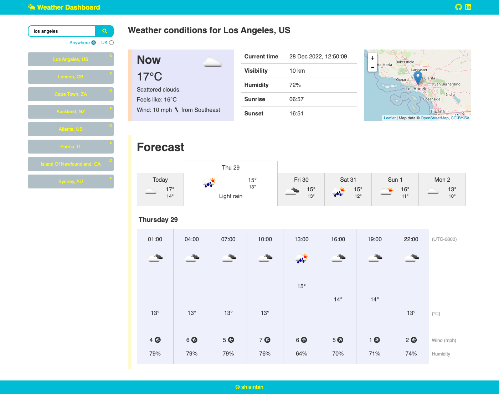

# Weather Dashboard

## Description

A weather dashboard app that allows the user to search for cities around the world and view its 5-day forecast.

## Usage

This app works with the [OpenWeatherMap API](https://openweathermap.org/api) to fetch weather data, before dynamically updating the page. The app is accessible at the link below.

https://cozy-sprinkles-a45830.netlify.app/

The user can view the forecast for a different day by clicking on a different date tab. Users can also quickly search for a recently searched city again by clicking on its button which should be located in the recent history column on the left of the page.

More details (better description, fuller instructions including screenshots, credit section) later.

**Update 28 Dec**: after doing some more work, particularly adding a 'Now' section, the look of the app has changed to something below.

I've spent a ton of work on this to be honest but I've learnt a lot. It's really important that I document how I did several things, if only so that I can look back and understand things myself. Off the top of my head, the things that stand out are:

- `position: absolute`, `position: relative`, for taking elements out of the flow of the page but bounded by its parent. Really useful for positioning items (e.g., the 'x' close button for recent searches, the larger icon in the 'Now' panel, the temperatures in the hourly breakdown)
- A lot of stuff to do with Moment.js, particularly understanding UTC time, UTC offsets, yada yada
- Using global CSS rules, e.g. a `wrapper` class for wrapping elements to a certain width or with common padding and margin
- using `.map()` and `.filter()` to cherry-pick data, e.g. getting all the days of the month from a single property in an array of objects, or filtering an array of forecasts based on a condition.
- a bit of stuff on regex or character mapping (`.match()`) which was useful for ensuring the -ve sign was considered when converting a string to a number
- integrating maps, so both Leaflet and OpenStreetMap
- stopping event propagation, which was important when the 'x' was clicked in a parent element that also had an event listener

On top of that

- more practice with translating logic or pseudocode into actual code
- dealing with error debugging (a lot of console.log()ing)
- spending a bunch of time trying to get things to look a certain way, or position themselves how I want them to
- spending an even greater amount of time on colour schemes and layout (struggled big time here tbh)
- more practice with jQuery and taking advantage of how it makes some things easier, particularly traversal, looping and fetching API data
