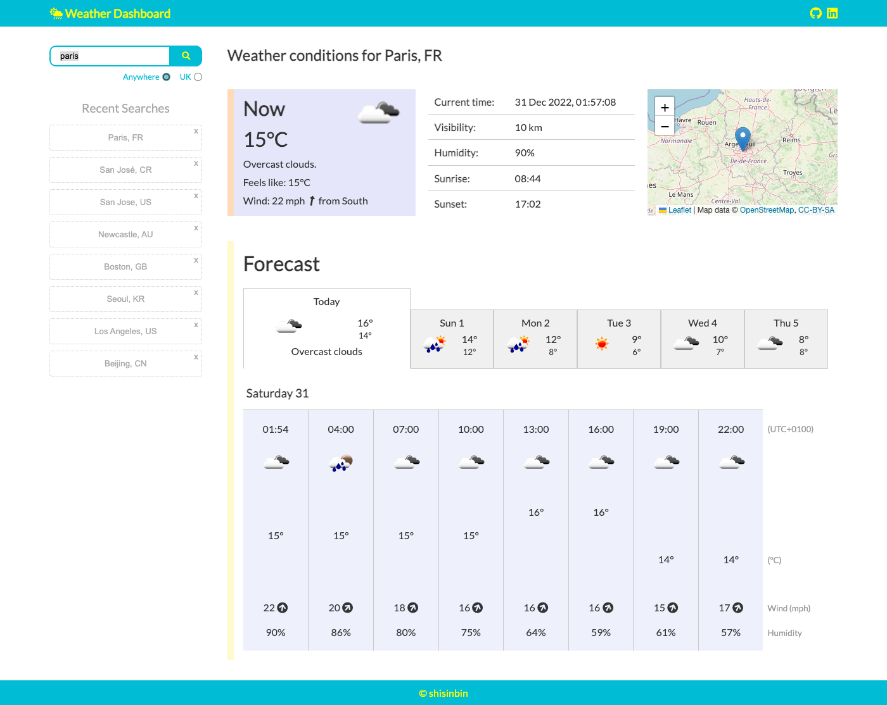
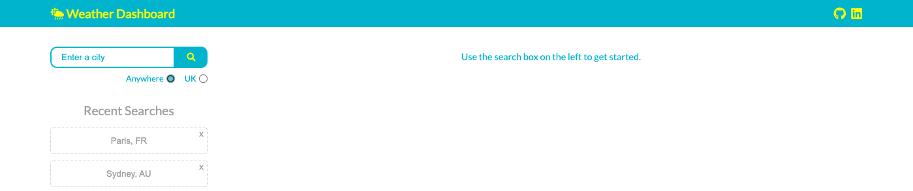
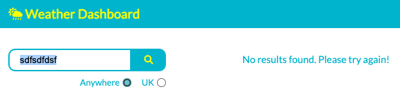
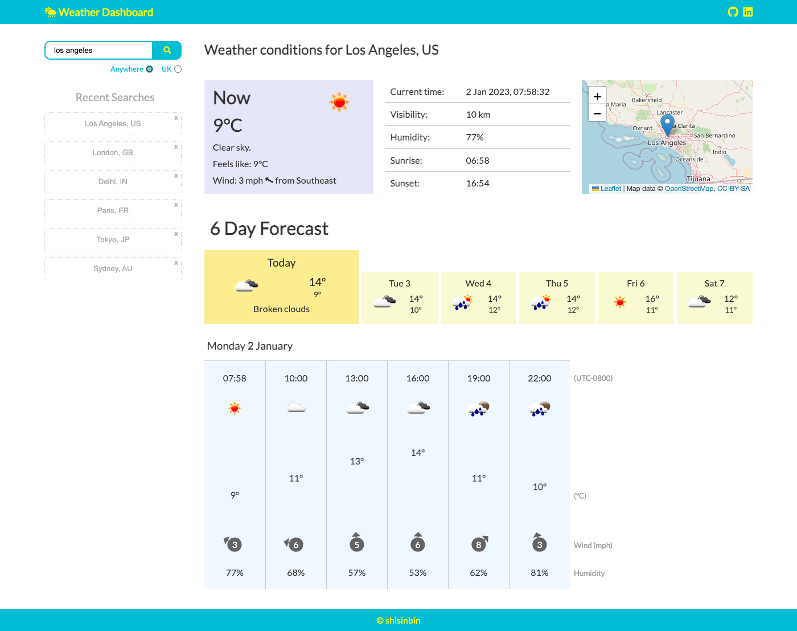
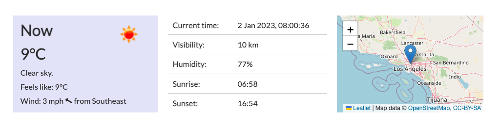
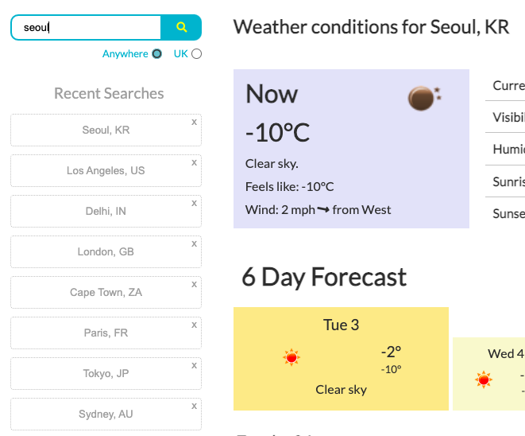
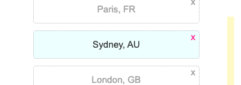
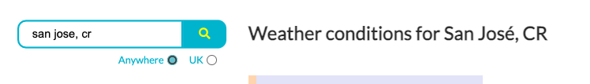

# Weather Dashboard

    

## Description

A weather dashboard app that allows a user to view both the current and forecasted weather conditions for any city in the world.

This app was developed to help further my understanding of how to access data from a back-end server. Specifically, how to fetch weather data using the [OpenWeatherMap API](https://openweathermap.org/api) and then use this data to dynamically update HTML and CSS.

While working on this app, I gained valuable experience in working with APIs and also had the opportunity to further develop my front-end skills.

## Getting Started

To access the app, navigate to the link below in a browser on a device that supports a wide layout.

https://cozy-sprinkles-a45830.netlify.app/

You can search for a city by using the search bar at the top left of the page or by clicking on a recently searched city below the search bar.

You can limit your searches to UK cities by checking the 'UK' radio button below the search bar.

If the OpenWeatherMap API is unable to find a city that matches your search term, you will receive appropriate feedback.

If the OpenWeatherMap API is able to find a city that matches your search term, you will be presented with the weather conditions for that city.

The weather conditions are displayed in two sections: the current weather conditions and the forecasted weather conditions.

In the current weather conditions section, you can view information about a city's current weather, the current date and time, and its location via an interactive map.

In the forecast section, you can view information about the weather for every third hour for the next 5-6 days. You can view the forecast for a specific day by clicking on one of the day 'tabs'. Each tab displays the maximum and minimum temperature for that day.

Recent searches are stored on your local browser storage and are used to dynamically update the Recent Searches section of the webpage. The section displays a maximum of eight recent searches, listed in order of most recent to least recent.

You can remove a single recent search from local storage by clicking the 'x' in the top right corner of its button.

Finally, to make your search more specific, you can follow the city name with a comma and its country code (please refer to [ISO 3166](https://www.iso.org/obp/ui/#search) for codes).

## Features

Autocomplete is the only really one maybe. Perhaps I can drop this section and describe the autocomplete feature in the section above.

Maybe also the fact that the time blocks adapt correctly to different timezones (including giving user bit of info about each timezone with both the clock and the descriptive 'UTC+0530' thing).

## Limitations

Not really supported by wide browsers (would need to make forecast element horizontally scrollable)

search results from the api - could maybe show the top 3 results and get the user to click the one that applies

not a big fan of chaining get requests. learning about parsing 'promises' into separate functions might be worth looking into (can't really do that at the moment due to asynchronous nature of requests and my current knowledge level)

finally, aesthetics. firstly i'm limited by the icon images, which are small and kinda dated. there is [this cool resource](https://erikflowers.github.io/weather-icons/) that I have experimented with, but found it doesn't mesh well with my current layout. in a weird sort of way, my layout (the pastel colours, the uncohesiveness of it) looks better with the dated icons, which is kinda worrying. but anyway, if I improve my knowledge and skills with design, then that resource is definately something to bear in mind in future especially if I want to hide away sections (recent searches being the main one) and make it more mobile friendly. and just generally, I'm not good at figuring out nice layouts and colour schemes, this doesn't come naturally (yet or ever??)

another limitation: the fact that the api only gives free forecast data about every third hour, and other limitations of the data like how it's difficult to decipher chances of precipitation from the mm of rain expected within a time block.

## Credits

Wow, gonna include a bunch here. In terms of inspiration, defo BBC Weather, Met Office, and particularly TimeAndDate.com

## Documentation

Maybe links to the docs for OpenWeatherMap Api, Geoapify, jQuery UI, etc, etc
