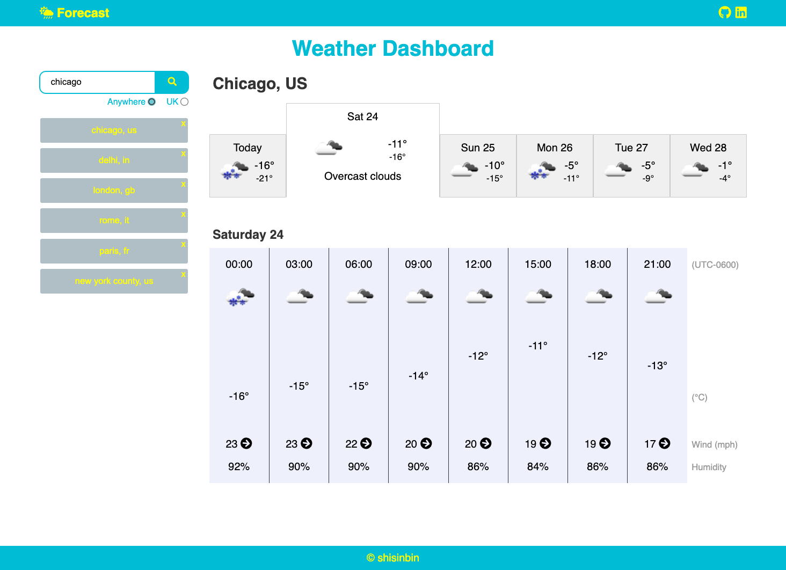
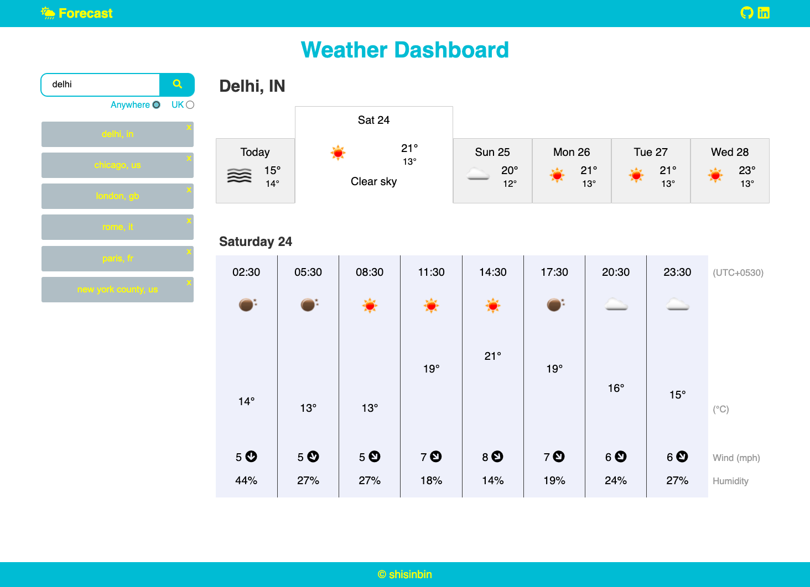

# Weather Dashboard

## Description

A weather dashboard app that allows the user to search for cities around the world and view its 5-day forecast.

## Usage

This app works with the [OpenWeatherMap API](https://openweathermap.org/api) to fetch weather data, before dynamically updating the page. The app is accessible at the link below.

https://cozy-sprinkles-a45830.netlify.app/

The user can view the forecast for different days by clicking one of the date tabs, and they can also quickly search for a recently searched city again by clicking on the button for it on which should be located in the recent history column on the left of the page.

More details (better description, fuller instructions inclduing screenshots, credit section) later.
