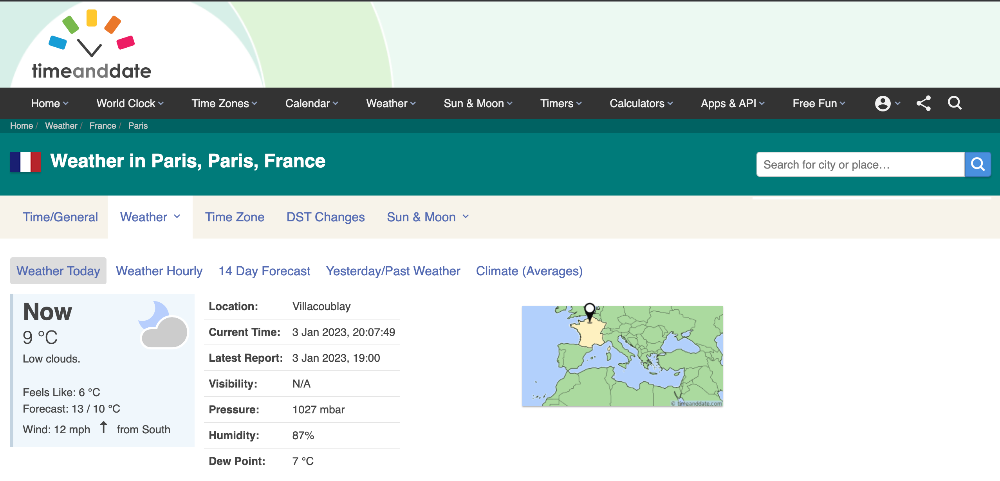
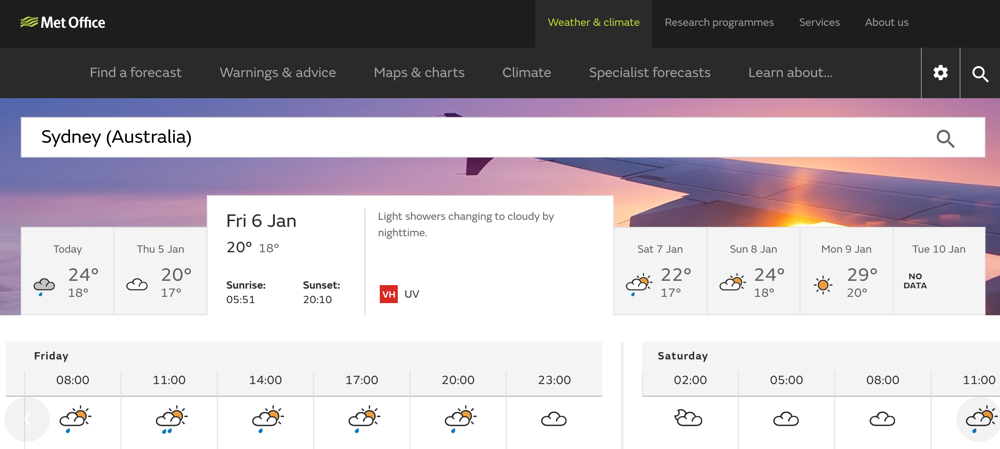
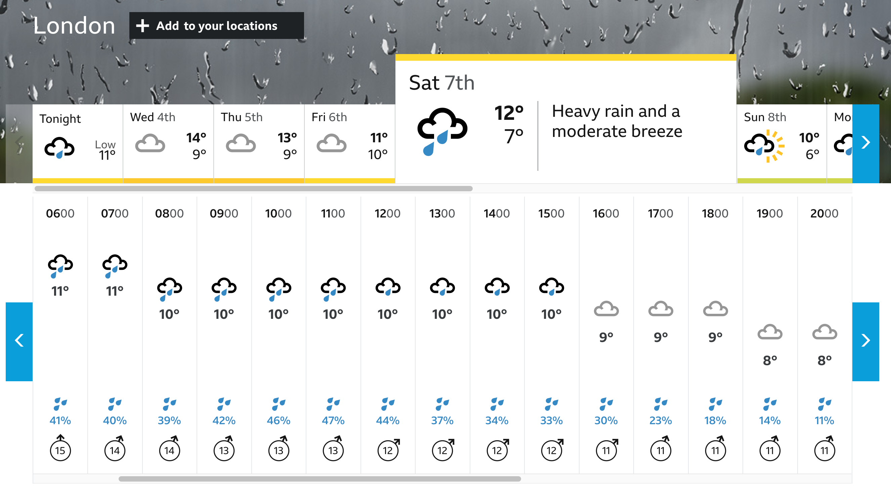

# Weather Dashboard

    

    

## Description

Welcome to my weather dashboard app! With this app, you can view the current and forecasted weather conditions for any city in the world.

This app was built to help improve my skills with working with APIs and accessing data from a back-end server. I learned how to use the [OpenWeatherMap API](https://openweathermap.org/api) to fetch weather data and use it to dynamically update a webpage's HTML and CSS. I also learned how to work with [Leaflet](https://leafletjs.com/), a map data framework, and [Geoapify](https://www.geoapify.com/), a location-based API that I used to add an autocomplete feature for city searches.

While working on this project, I gained valuable experience in front-end development using HTML, CSS, and JavaScript. I hope you enjoy using the app as much as I enjoyed building it!

## Getting Started

To access the app, navigate to the link below in a browser on a device that supports a wide layout (or alternatively on mobile).

https://chipper-sunflower-aae134.netlify.app/

### Searching for cities

You can search for a city by using the search bar at the top left of the page or by clicking on a recently searched city below the search bar. To make your search more specific, you can follow the city name with a comma and its country code (please refer to [ISO 3166](https://www.iso.org/obp/ui/#search) for codes).

You can also limit your searches to UK cities by checking the 'UK' radio button below the search bar, and if the API is unable to find a city that matches your search term, you will receive appropriate feedback.

### Understanding the layout

If the API is able to find a city that matches your search term, you will be presented with the weather conditions for that city.

The weather conditions are displayed in two sections: the current weather conditions and the forecasted weather conditions.

In the current weather conditions section, you can view current weather information (including wind speed and direction), the current date and time, and the location via an interactive map.

In the forecast section, you can view information about the weather for every third hour for the next 5-6 days. You can view the forecast for a specific day by clicking on one of the day 'tabs'. Each tab displays the maximum and minimum temperature for that day.

### Adding and removing searches to recent history

Successful city searches are stored on your local browser storage and are used to dynamically update the Recent Searches section of the webpage. A maximum of eight recent searches are displayed, listed in order of most recent to least recent. You can remove a single recent search from local storage by clicking the 'x' in the top right corner of its button.

### Mobile layout

The weather dashboard is now mobile-friendly! The following image demonstrates the functionality on mobile.

## Features

### Smart city search with autocomplete

There is a smart city search feature which uses autocomplete to provide suggestions as you type, making it easy to find the city you're looking for. Simply click on a suggestion to initiate a search.

### Global weather, localised for you

Get the weather information for any city in the world, displayed in terms of the local time. This means you can get accurate and timely weather forecasts no matter where you are.

### Explore any location using an interactive map

When you make a search, you'll get a map of the city's location. You can zoom in and out to explore the area.

## Limitations

Forecasts are only available every third hour, with a maximum of 40 forecasts (up to 5-6 days). It is not currently possible to include a chance of precipitation in the forecasts due to the limited data available (only rain volume in mm for 3 hours is provided).

The web app currently has limited support for browser sizes other than wide desktop or mobile. It may not display or function correctly on browsers with intermediate sizes.

The icon image quality is poor, which makes it difficult to increase its size, and the icons themselves are quite dated.

## Future enhancements

Right now, the app chains together a series of get requests before using the modified data to call another function. In the future, I want to use promises and handle asynchronous calls better by breaking the get requests into separate functions. This will make the app easier to maintain and perhaps faster as well.

Another thing I'd like to improve is the app's support for intermediate browser sizes. Currently, it works well on wide desktop browsers and mobile devices, but there's not much support for sizes in between. I want to make the app more responsive and look good on all browser sizes. I found a solution for making a container scrollable to help with mobile layouts, but I think it can be done better, using [CSS Grid](https://dev.to/ratracegrad/horizontal-scrolling-using-css-grid-4b20) or [Flexbox](https://webdesign.tutsplus.com/tutorials/horizontal-scrolling-card-ui-flexbox-and-css-grid--cms-41922).

The app's layout and design work fine, but I would like to make it nicer and more modern. I will work on the layout and color scheme in future to make it more attractive and sleek. I also think it would be a good idea to use higher quality weather icons to make for a better overall experience, and [this resource](https://erikflowers.github.io/weather-icons/) looks like it might help.

The weather icons provided by the OpenWeatherMap API are [grouped](https://openweathermap.org/weather-conditions) into the following: Thunderstorm, Drizzle, Rain, Snow, Atmosphere, Clear, Clouds. It might be worth finding images to represent each of these groups and then use them as a background image for the forecast section for that day. At the moment a golden colour is used to highlight the day tabs, but to the untrained eye, this might indicate sunny weather. Instead, if these tabs were coloured neutrally but its background was an image representing the group (e.g. a rainy image to represent rain, a snowy image to represent snow) then this might improve both the look and intuitiveness of the app.

## Credits

Three sites were a big help for understanding how the weather data could be presented.

[Time and Date](https://www.timeanddate.com/)

[Met Office](https://www.metoffice.gov.uk/)

[BBC Weather]()

Other credits:

- [OpenWeatherMap](https://openweathermap.org/api)
  - [Geocoding API](https://openweathermap.org/api/geocoding-api) for getting latitude and longitude to use with the following two APIs
  - [Current Weather API](https://openweathermap.org/current#one)
  - [5 day / 3 hour API](https://openweathermap.org/forecast5#5days)
  - [Fields in API response](https://openweathermap.org/weather-data)
  - [Weather conditions / Weather icons](https://openweathermap.org/weather-conditions)
- [Font Awesome](https://fontawesome.com/v5/search)
- [jQuery Docs](https://api.jquery.com/)
- [Autocomplete - jQuery UI Docs](https://jqueryui.com/autocomplete/), in particular grafting a [`.select()`](https://api.jqueryui.com/autocomplete/#event-select) event listener
- [Leaflet](https://leafletjs.com/index.html) for including an interactive map
- [Geoapify API](https://apidocs.geoapify.com/) for helping to include an autocomplete feature
- [Google Fonts](https://fonts.google.com/) for importing [Lato](https://fonts.googleapis.com/css?family=Lato)
- [Changing IMG SVG styles with CSS \[Stack Overflow\]](https://stackoverflow.com/questions/24933430/img-src-svg-changing-the-styles-with-css#:~:text=203-,Try%20pure%20CSS%3A,-.logo%2Dimg%20%7B) for understanding how to use the CSS rule `filter: invert() sepia() saturate() hue-rotate();` to adjust the colour of an svg image
- [Colin Lord - How To Create Horizontal Scrolling Containers \[codeburst\]](https://codeburst.io/how-to-create-horizontal-scrolling-containers-d8069651e9c6)
- [Chrome Capture \[Chrome Webstore\]](https://chrome.google.com/webstore/detail/chrome-capture-screenshot/ggaabchcecdbomdcnbahdfddfikjmphe/related?hl=en-GB) gif-making tool
- [GIF Optimizer](https://ezgif.com/optimize) compressing gifs
- [Poole Yacht Club](https://www.pooleyc.co.uk/weather/) for [this nifty wind direction svg](https://cdn.pooleyc.co.uk/static/img/weather/icons/wind_direction.svg)
- [Kevin Powell - The closest thing we have to a CSS parent selector \[YouTube\]](https://www.youtube.com/watch?v=2-xdcDsqsAs) for understanding `focus-within`
- [Erik Flowers - Weather Icons](https://erikflowers.github.io/weather-icons/)
- [How to calculate wind speed and wind direction](https://confluence.ecmwf.int/pages/viewpage.action?pageId=133262398#:~:text=The%20meteorological%20wind%20direction%20is,westerly%20wind%20is%20270%C2%B0.) for understanding what 'meteorological' wind means
- [How do we measure precipitation \[Windy.app\]](https://windy.app/blog/how-do-we-measure-precipitation.html) for helping to understand chance of rain percentage in forecasts
- [Building a Weather App using JavaScript & CSS](https://medium.com/@arifkabir/building-a-weather-app-using-javascript-css-1f05f160a3b0) for cool relevant design ideas
- [Shachee Swadia - A Beginner's Guide to Creating a Map Using Leaflet.js \[sitepoint\]](https://www.sitepoint.com/leaflet-create-map-beginner-guide/)
- [OpenStreetMap](https://www.openstreetmap.org/) used by Leaflet for the map
- [How to Improve Page Speed with `async` and `defer` - freecodecamp.org](https://www.freecodecamp.org/news/javascript-performance-async-defer/) to help understand different ways to load JavaScript files and their benefits
- [Weather Favicon](https://favicon.io/emoji-favicons/sun-behind-rain-cloud) for adding a favicon to the app

<!-- ## Documentation

Maybe links to the docs for OpenWeatherMap Api, Geoapify, jQuery UI, etc, etc -->
