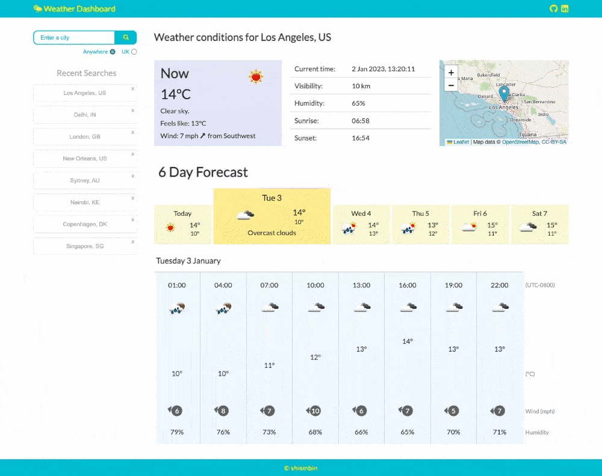

# Weather Dashboard

    

    

## Description

A weather dashboard app that allows a user to view both the current and forecasted weather conditions for any city in the world.

This app was developed to help further my understanding of how to access data from a back-end server. Specifically, how to fetch weather data using the [OpenWeatherMap API](https://openweathermap.org/api) and then use this data to dynamically update HTML and CSS.

I went further by learning how to work with [Leaflet](https://leafletjs.com/), a framework for presenting map data, and [Geoapify](https://www.geoapify.com/), a location-based API which was used for integrating an autocomplete feature for city searches.

While working on this app, I gained valuable experience in working with APIs and further developed my front-end skills in HTML, CSS and JavaScript.

## Getting Started

To access the app, navigate to the link below in a browser on a device that supports a wide layout (or alternatively on mobile).

https://cozy-sprinkles-a45830.netlify.app/

### Searching for cities

You can search for a city by using the search bar at the top left of the page or by clicking on a recently searched city below the search bar. To make your search more specific, you can follow the city name with a comma and its country code (please refer to [ISO 3166](https://www.iso.org/obp/ui/#search) for codes).

You can also limit your searches to UK cities by checking the 'UK' radio button below the search bar, and if the API is unable to find a city that matches your search term, you will receive appropriate feedback.

### Understanding the layout

If the API is able to find a city that matches your search term, you will be presented with the weather conditions for that city.

The weather conditions are displayed in two sections: the current weather conditions and the forecasted weather conditions.

In the current weather conditions section, you can view current weather information (including wind speed and direction), the current date and time, and the location via an interactive map.

In the forecast section, you can view information about the weather for every third hour for the next 5-6 days. You can view the forecast for a specific day by clicking on one of the day 'tabs'. Each tab displays the maximum and minimum temperature for that day.

### Adding and removing searches to recent history

Successful city searches are stored on your local browser storage and are used to dynamically update the Recent Searches section of the webpage. A maximum of eight recent searches are displayed, listed in order of most recent to least recent. You can remove a single recent search from local storage by clicking the 'x' in the top right corner of its button.

### Mobile layout

The weather dashboard is now mobile-friendly! The following image demonstrates the functionality on mobile.

## Features

### Smart city search with autocomplete

Our smart city search feature uses autocomplete to provide suggestions as you type, making it easy to find the city you're looking for. Simply click on a suggestion to initiate a search.

### Global weather, localised for you

Get the weather information for any city in the world, displayed in terms of the local time. This means you can get accurate and timely weather forecasts no matter where you are.

### Explore any location using an interactive map

When you make a search, you'll get a map of the city's location. You can zoom in and out to explore the area.

## Limitations

Forecasts are only available every third hour, with a maximum of 40 forecasts (up to 5-6 days). It is not currently possible to include a chance of precipitation in the forecasts due to the limited data available (only rain volume in mm for 3 hours is provided).

The web app currently has limited support for browser sizes other than wide desktop or mobile. It may not display or function correctly on browsers with intermediate sizes.

The icon image quality is poor, which makes it difficult to increase its size and the icons themselves are rather dated.

## Future enhancements

Right now, the app makes a series of get requests and chains them together before using the modified data to call another function. In the future, I want to use promises and handle asynchronous calls better by breaking the get requests into separate functions. This will make the app faster and easier to maintain.

Another thing I'd like to improve is the app's support for intermediate browser sizes. Currently, it works great on wide desktop browsers and mobile devices, but there's not much support for sizes in between. I want to make the app more responsive and look good on all browser sizes.

The app's layout and design work fine, but I want to make it look nicer and more modern. I'll keep working on the layout and color scheme to make it more attractive and sleek. I also want to upgrade the weather icons to something more modern and high-quality to make the app a better overall experience ([this resource](https://erikflowers.github.io/weather-icons/) might help).

## Credits

Wow, gonna include a bunch here. In terms of inspiration, defo BBC Weather, Met Office, and particularly TimeAndDate.com

## Documentation

Maybe links to the docs for OpenWeatherMap Api, Geoapify, jQuery UI, etc, etc
